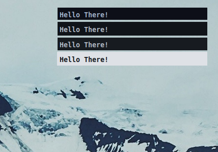

# Decay For Mako!

[Decay](https://github.com/decaycs) is going to theme `Mako`!



# Installation

In order to install a version of this port to mako, just see the next commands:

```sh
git clone --depth=1 https://github.com/decaycs/decay-mako ~/ # clone port
cd ~/decay-mako
mkdir -p ~/.config/mako
# replace <theme> with one of: dark-decay, decay, decayce or light-decay
cp -r ./configs/<theme>/config ~/.config/mako
```

# Thanks to

- [AloneER0](https://github.com/AloneER0)

# Enjoy
That's all. Enjoy!
